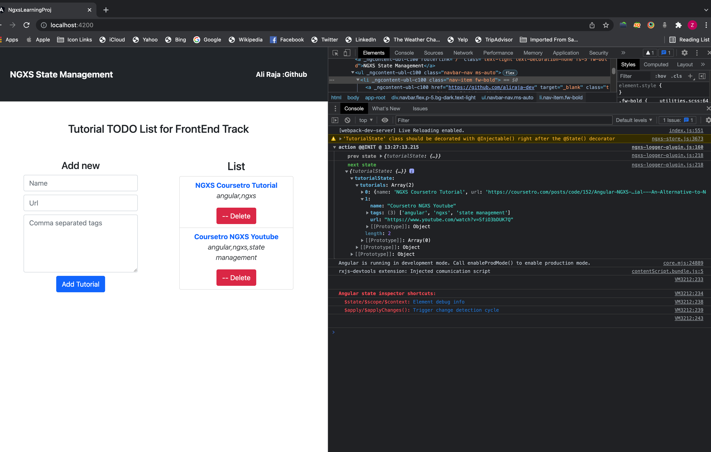
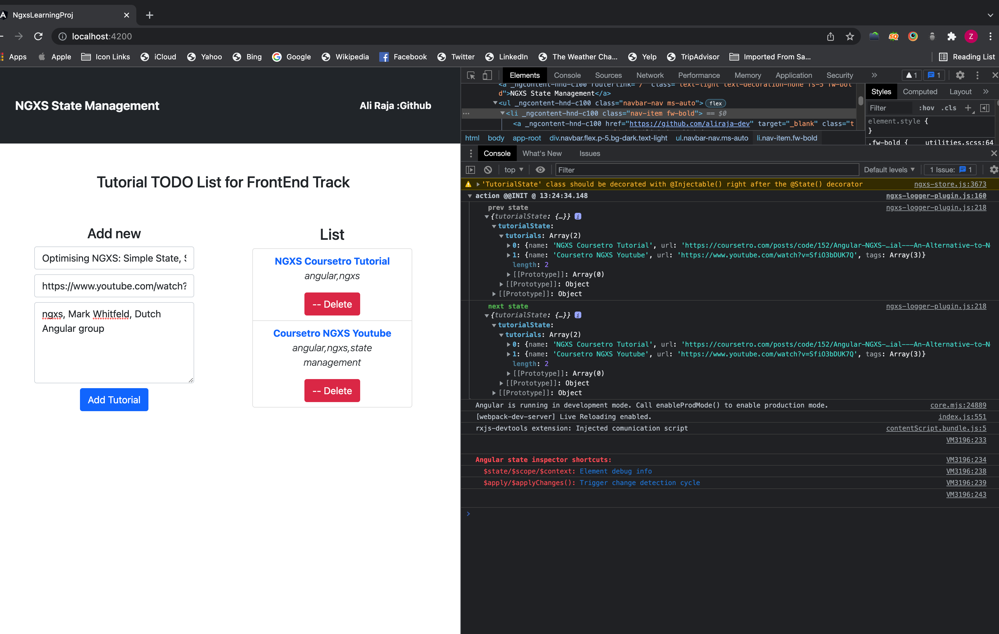
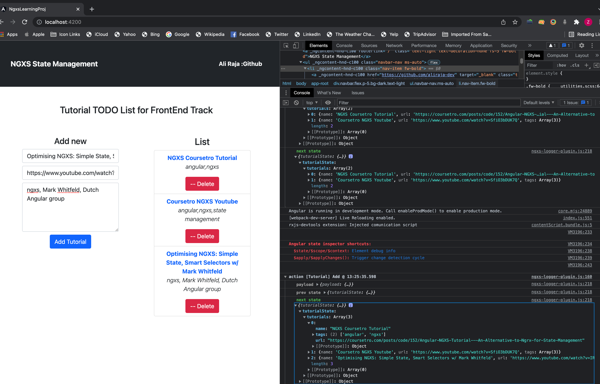

# NgxsLearningProj

This project was generated with [Angular CLI](https://github.com/angular/angular-cli) version 13.2.4.

#Project Details

This project is about incorporating NGXS into an angular app and maintaining a store and updating and listening to it. Created a tutorial list app using the https://coursetro.com/ NGXS post as a loose inspiration and further changed the State names and added another tag fields to understand clearly the NGXS process in contrast to the usual Singleton Service used as a cross communication mechanism for unrelated components in Angular apps as a single source of truth.

The tutorialsState is the state that keeps record of every tutorial in our app, and has two actions on it, Add and remove setup on it. Each having their own payloads that are required to add and remove them from the store.

A selector was also created in the state, for easy retrieval of a slice of state in any components that may require it instead of subscribing to the state in their constructors using state.select method.

Initial State using defaults for state

Before AddTutorial action is dispatched

After action has been dispatched to store and the next state is available

## Development server

Run `ng serve` for a dev server. Navigate to `http://localhost:4200/`. The app will automatically reload if you change any of the source files.
